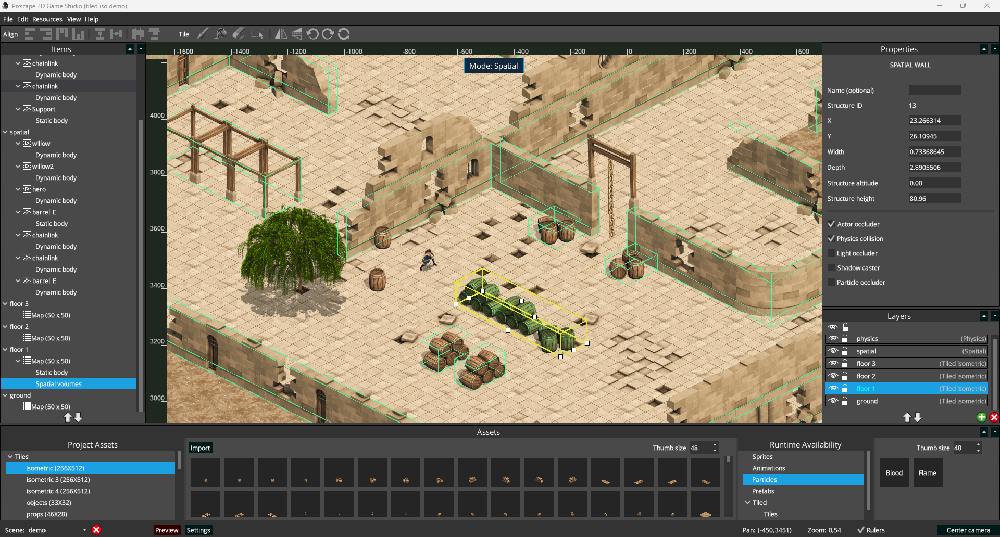

<h1>Pixscape Studio Free</h1>

[](CHANGELOG.md)<br>
[](#)<br>
[](#)<br>
[](LICENSE)

**Open-source 2D game studio for LibGDX and Pixscape Runtime.**

Build fast. Stay free. Keep full control.

🌐 **Website:** https://pixscape.games/  
📘 **Documentation:** https://pixscape.games/docs  
⚙️ **Runtime:** https://github.com/pixscapegames/pixscape-runtime  
📝 **Changelog:** [CHANGELOG.md](CHANGELOG.md)

<p align="center">
  
</p>

## What is Pixscape Studio Free?

Pixscape Studio Free is the open-source visual editor for **Pixscape Runtime**, built for developers who want the speed of a game editor without giving up code-level control.

It is designed for **LibGDX** projects and focuses on lightweight 2D production workflows: scenes, sprites, tiled and isometric maps, animations, particles, shaders, lights, physics, prefabs, runtime export, and deterministic 2.5D spatial ordering.

Pixscape Studio Free is released under the **Apache License 2.0**.

It is not a trial version. You can use it to build real games, including commercial games, with no Pixscape royalties, no runtime fees, and no hidden export fees.

**Pixscape Free is the foundation. Pixscape Pro funds the future.**

## Open-source foundation

Pixscape Studio Free is open source so developers can inspect it, build it, modify it, fork it if necessary, and trust it as a real foundation for real projects.

Pixscape Runtime is also open source under Apache License 2.0.

Pixscape Pro will be a separate optional edition focused on advanced production tools. Pro does not replace, restrict, or weaken Pixscape Studio Free.

## Highlights

* **Open-source visual editor**
* **Built for LibGDX and Pixscape Runtime**
* **Scene-based 2D workflow**
* **Sprite and animation editing**
* **Orthographic and isometric tiled maps**
* **TMX and TSX import workflows**
* **Single-image and image collection tilesets**
* **Tileset profiles for native-size and isometric tiles**
* **Spatial V3 deterministic 2.5D wall and actor ordering**
* **Prefab authoring and drag-and-drop placement**
* **Box2D physics integration**
* **Shader and light workflows**
* **Particle effects**
* **Desktop, Android and HTML5/WebGL2 export pipeline**
* **Runtime-first architecture**
* **Apache 2.0 license**

## Studio Features

### Visual Editing

* Scene editor
* Asset browser
* Drag-and-drop placement
* Multi-layer editing
* Context menus and property panels
* Canvas pan and zoom workflow
* Selection, lasso, gizmo and resize tools
* Debug console

### Sprites and Animation

* Sprite placement and configuration
* Spritesheet-based animations
* Animation clips
* Asset-level animation definitions
* Multi-animation entities with switchable Animation assets
* Runtime animation export
* Repeatable sprites
* 2.5D spatial properties for sprites and animations

### Tiled Maps

* Orthographic and isometric tiled maps
* TMX map import with external TSX files and inline tilesets
* Standalone TSX import for supported single-image tilesets
* Single-image and image collection tilesets
* Tiled image layers imported as editable Pixscape Classic layers
* Tiled tile-animation import and editing
* Tileset profiles for logical cell size, native render size, projection, anchors and offsets
* Margin and spacing support for atlas tilesets
* Tile flip and diagonal transform flags compatible with Tiled
* Repeatable image layers and sprites
* Authored collision polygons
* Spatial V3 wall authoring with connected structures and junction handling
* Layer-based rendering and depth control

### Spatial V3

* Deterministic actor, wall and tiled-structure ordering
* Automatic wall structure merging and splitting
* Precise wall footprint editing
* Corner and junction handling for complex 2.5D structures
* Altitude-aware walls and tiled layers
* Physics-footprint-aware actor ordering
* Optional Spatial-generated collision fixtures for authored walls

### Physics

* Box2D body authoring
* Fixtures and authored shapes
* Physics editing mode
* Runtime physics export
* Physics-aware actor footprints for Spatial ordering
* Optional automatically managed wall collision fixtures
* Custom collision-shape authoring for advanced layouts and passages

### Rendering

* Pixscape Runtime export
* Sprite and tiled rendering
* Profile-aware tile placement
* Native-size tile rendering with anchors and offsets
* Repeatable renderables
* Shader support
* Light support
* Particle support
* Atlas workflows
* Runtime asset availability
* Preview instrumentation for texture binds, batch flushes and region-cache resolution

### Prefabs

* Create reusable prefabs from selected entities
* Save prefab assets
* Preview prefabs in the asset browser
* Drag and drop prefabs into scenes
* Export prefab data for runtime use

## Pixscape Runtime

Pixscape Studio Free exports projects for **Pixscape Runtime**.

Pixscape Runtime is a separate open-source runtime built on **LibGDX** and **Artemis-ODB ECS**.

Current runtime dependency:

```gradle
games.pixscape:pixscape-runtime:0.1.9
```

Pixscape Runtime is published on Maven Central:

https://central.sonatype.com/artifact/games.pixscape/pixscape-runtime

## Platforms

Pixscape Studio Free currently focuses on projects targeting:

* Desktop
* Android
* HTML5 / WebGL2

Pixscape Studio requires **Java 21**.

Pixscape Runtime is built with modern tooling and published as Java 8-compatible bytecode for broader LibGDX ecosystem compatibility.

iOS/RoboVM is not currently listed as an officially tested target.

## Build From a Clean Clone

Requirements:

* JDK 21
* The Gradle wrapper included in this repository

On Windows:

```powershell
.\gradlew.bat --console=plain compileJava test :html-player:compileJava
```

On Unix-like systems:

```sh
./gradlew --console=plain compileJava test :html-player:compileJava
```

To perform a complete GWT compilation of the HTML preview player:

```powershell
.\gradlew.bat :html-player:compileGwt
```

On Unix-like systems:

```sh
./gradlew :html-player:compileGwt
```

Generated outputs such as `.gradle/`, `build/`, `html-player/build/`, and `html-player/war/` are local build artifacts and should not be committed.

## Linux Distribution Builds

Build the reproducible Linux x64 tar.gz distribution:

```sh
./gradlew linuxTarGz
```

This writes:

```text
build/distributions/Pixscape-Studio-Free-<version>-linux-x64.tar.gz
build/distributions/Pixscape-Studio-Free-<version>-linux-x64.tar.gz.sha256
```

Build the optional x86_64 AppImage with `appimagetool`:

```sh
./gradlew appImage -Pappimagetool=/path/to/appimagetool
```

`appimagetool` is not committed to this repository. The Gradle task looks for it in this order:

* `-Pappimagetool=/path/to/appimagetool`
* `APPIMAGETOOL=/path/to/appimagetool`
* an executable named `appimagetool` on `PATH`

The AppImage build writes:

```text
build/distributions/Pixscape-Studio-Free-<version>-x86_64.AppImage
build/distributions/Pixscape-Studio-Free-<version>-x86_64.AppImage.sha256
```

## HTML Preview Template

The directory `src/main/resources/html-preview-template/` is intentionally versioned.

It contains the prebuilt GWT HTML preview player used by Pixscape Studio Free, so a clean clone can run the preview flow without requiring every contributor to regenerate the GWT bundle manually.

Maintainers may refresh this template when the HTML preview player changes.

## Documentation

Full documentation is available on the official website:

📘 https://pixscape.games/docs

## Changelog

See [CHANGELOG.md](CHANGELOG.md) for release notes.

## License

Pixscape Studio Free is released under the **Apache License 2.0**.

See [LICENSE](LICENSE) and [NOTICE](NOTICE) for details.

Apache 2.0 covers the source code license. It does not grant trademark rights to Pixscape names, logos, icons, or branding.

See [TRADEMARK.md](TRADEMARK.md) for trademark usage rules.
